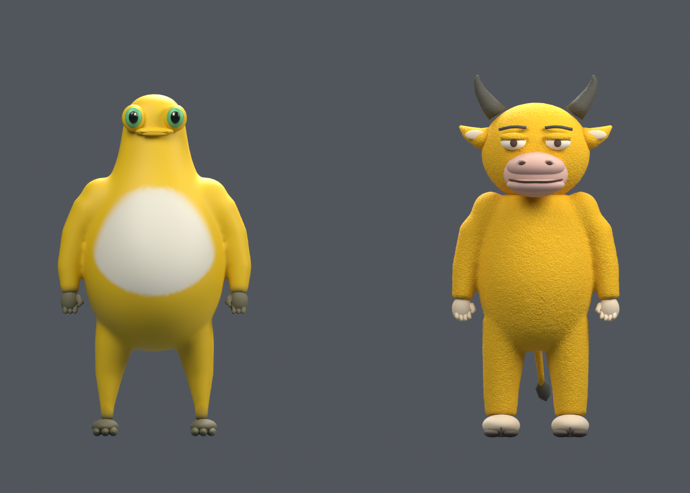

# 两套参考图角色

2026-09-11，v0.14.7。用户要求依据提供的两张多视图分别在 Blender 精细建模、添加可移动骨架，并加入皮肤库，同时能看到建模过程。

## 文件与使用

- [可编辑 Blender 工作室](../../assets/models/character-studio/turnaround-characters.blend)：两套独立模型、分开的脸／手脚部件、蒙皮权重、骨架、四条动作、打包参考图、法线纹理与灯光。
- [金黄圆肚蛙 GLB](../../assets/models/golden-frog.glb)；[金黄小牛 GLB](../../assets/models/golden-bull.glb)。名字是本轮 AI 采用的库内名称，不是已核实的角色官方名称。
- [游戏衣柜](../../game.html)：主菜单“皮肤衣柜”，分别选择“我自己”或“家长”，选择新外观后穿上；十一套全部保留。选皮肤不会改变难度、声响、判定或角色碰撞。
- [模型检查数据](model-audit.json)；本地验证夹具源码为 `source/tools/character-studio/verify.html` 与 `verify.js`，依赖本机 `source/node_modules`，只用于开发。

在 Blender 的 Outliner 展开 `golden-frog` 或 `golden-bull`，选中对应 `Rig` 后进入 Pose Mode，可分别转动躯干、上下臂、手指、大小腿、脚掌、眼睛和下颌；小牛另有耳骨及两段尾骨。NLA 面板中的 Idle、Walk、Crouch、Reach 是本项目编写的演示动作，默认轨道静音，避免叠加。选择一条动作放到 Action Editor，或仅启用对应 NLA 轨道即可播放。骨架是 FK 变形骨架，没有自动步态规划、面部捕捉或完整 IK 控制器。

## 实际资产

| 角色 | 骨骼 | 源网格顶点 | 三角面 | 游戏高度 | GLB 绘制材质组 |
| --- | ---: | ---: | ---: | ---: | ---: |
| 金黄圆肚蛙 | 30 | 35,650 | 71,180 | 约 1.670 | 7 |
| 金黄小牛 | 38 | 46,844 | 93,492 | 约 1.764 | 8 |

Blender 中分别保留 30／49 个可编辑网格部件；导出时只合并临时副本，保留分组权重。连续身体采用体素融合与局部平滑；脸、手指、脚趾、牛角、口鼻、耳朵和尾巴分别制作。小牛表面使用几何起伏和自制、可平铺的切线空间法线图，GLB 内嵌所有运行贴图，不使用远程 CDN。游戏继续实时驱动骨骼，并为这两套自然垂臂骨架单独处理前臂、膝盖、脚踝与尾巴。

## 来源与边界

两张图片由用户提供，作为外形、比例和配色参考；没有把图中的文字当作操作指令。图片背后的作者与角色 IP 许可未核实。本项目只记录用户提供参考图及本地建模的事实，不声称这是官方模型、官方授权或整套资产 CC0。

参考图 SHA-256：

- 第一张：`2e4e1b508c1c18b66ee77018222fad00d0b20644249054c38606daf33da2fc8d`
- 第二张：`ece4cdb3c4659842e54ab330f0ca3d1c35d7043fda2c178417bf5d1da2d8917c`

未提供的关节位置、隐藏部位、手指结构、命名、拓扑密度、权重、纹理与动作曲线均为 AI 建模选择；不是用户逐项确认。当前是根据图片重建的可动画游戏改编，尚未获得用户对相似度及变形质量的审定。没有使用付费生成服务或下载人物包；Blender 内置功能已足够完成本轮。

## 验证与预览

Blender 检查：两套模型均无未绑定顶点、异常权重和非有限坐标；每顶点最多三个有效骨骼影响；无开放边或非流形边。检查了实际蒙皮顶点位移，不只检查骨骼名称。Node 的衣柜、家长换装及新 GLB 检查共 12 项通过，正式 Vite 构建成功。

本地浏览器实际载入 GLB，确认独立克隆骨架、四条动作数据、有限动画包围盒、正常游戏尺度与实际顶点变形；游戏衣柜的两套预览、玩家／家长分别换装与保存、进入游戏、镜头切换及短距离键盘移动已检查。刷新后两种角色选择独立保留，最终游戏浏览器无错误／警告。窗口内展示了建模阶段、骨架和真实走路播放。没有做三夜整局、实体 USB 手柄或真人美术审定，不以这些专项检查代替完整玩法与性能回归。

[三分之四视角](three-quarter.png) · [背面](back.png) · [蛙侧面](golden-frog-side.png) · [牛侧面](golden-bull-side.png) · [蛙脸部](golden-frog-face.png) · [牛脸部](golden-bull-face.png) · [行走姿态](walk-pose.png)

## 重建脚本

脚本在 [source/tools/character-studio](../../source/tools/character-studio/)。设置 `CHARACTER_REFERENCE_FROG`、`CHARACTER_REFERENCE_BULL` 为参考图路径，或将参考图放在脚本注明的临时路径。用 `Blender --python source/tools/character-studio/live_session.py` 启动可见会话；它仅处理本机固定队列中的命名制作阶段，没有网络控制端口。

阶段顺序：`setup` → `forms` → `details` → `extension` → `refine_forms` → `textures` → `rigging` → `animations` → `rig_view` → `movement_preview` → `polish` → `material_refinement` → `unify_uv` → `export_models` → `render_front` → `render_review`。当前脚本已包含修正后的根骨垂直轴。材质和形体细修阶段修改实际网格，不应对同一场景反复执行；重新制作时从新工作室开始。默认立方体场景保留，但导出明确限制为当前角色场景。
